> Результаты нагрузочного тестирования до и после индекса:
>
> |  | Количество одновременных запросов: 1 | Количество одновременных запросов: 10 | Количество одновременных запросов: 100 | Количество одновременных запросов: 1000 |
> |--|--|--|--|--|
> | графики latency до индекса | 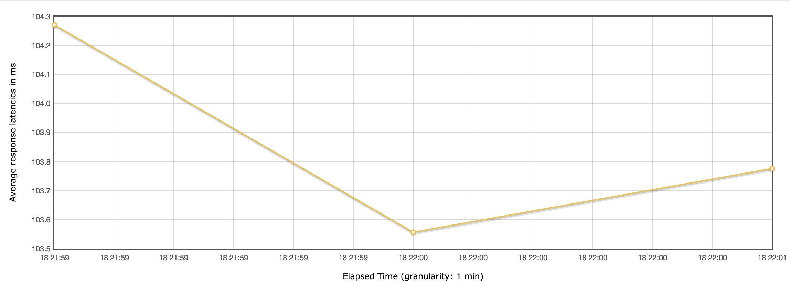 | 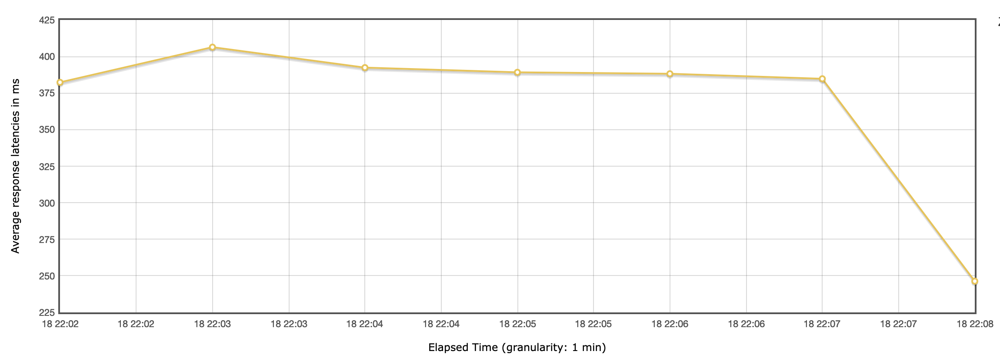 | 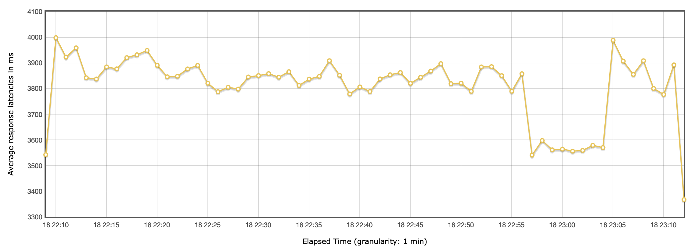 | 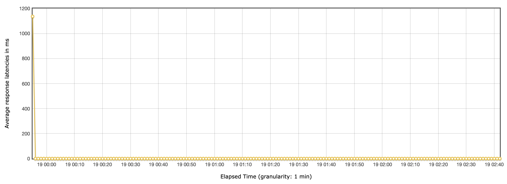 |
> | графики latency после индекса | 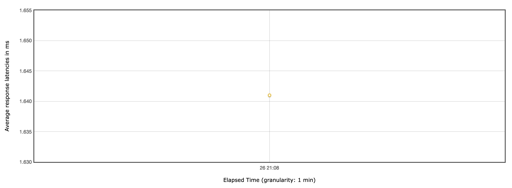 | 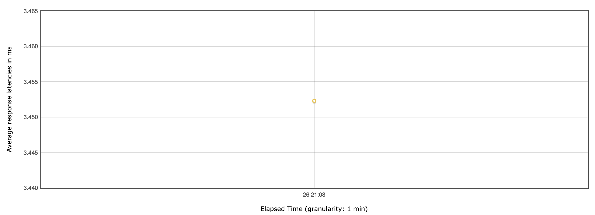 | 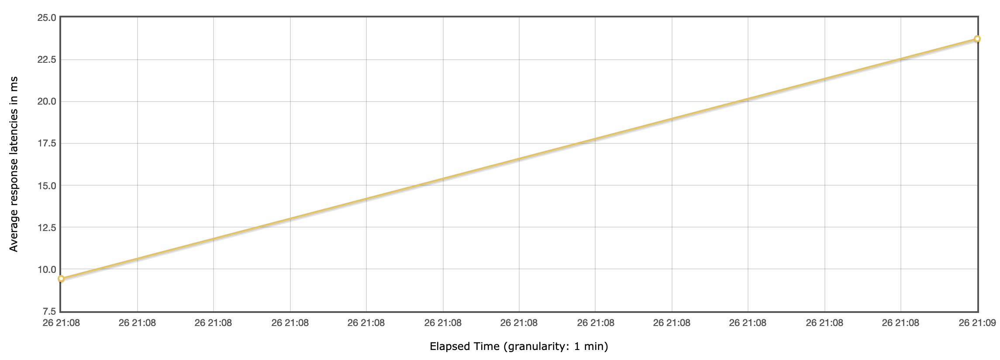 | 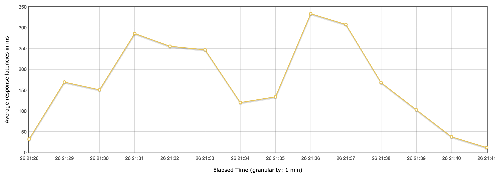 |
> | графики throughput до индекса | 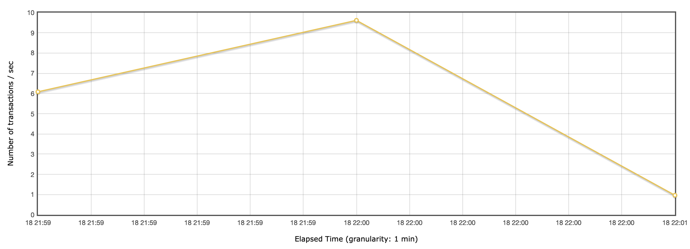 | 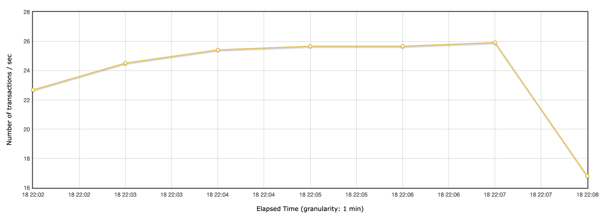 | 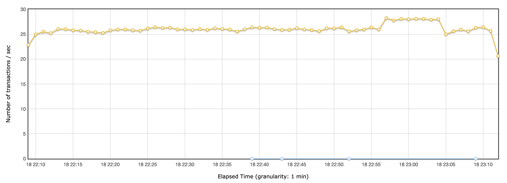 | 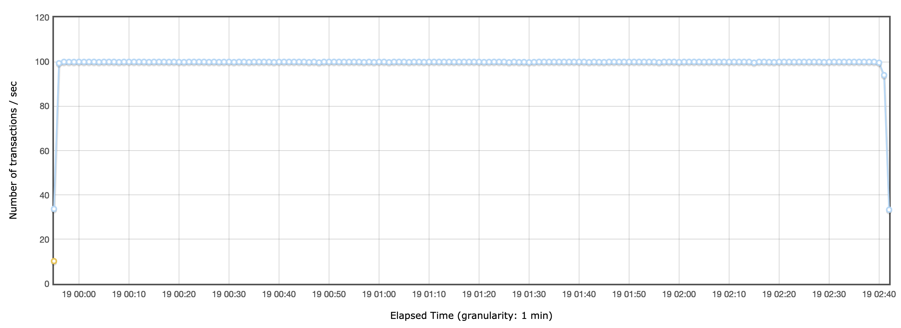 |
> | графики throughput после индекса | 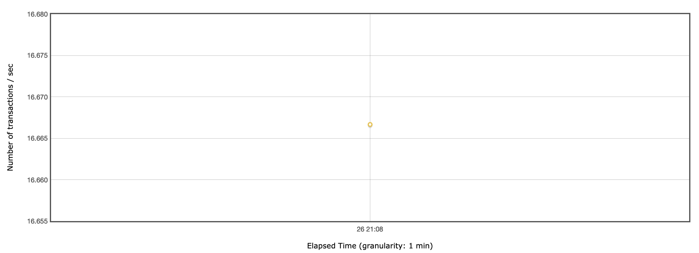 | 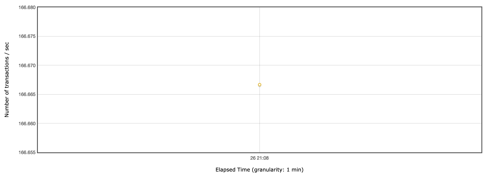 | 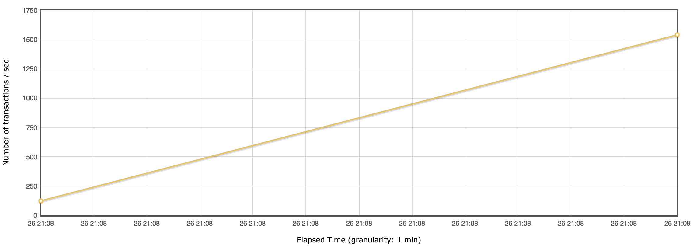 | 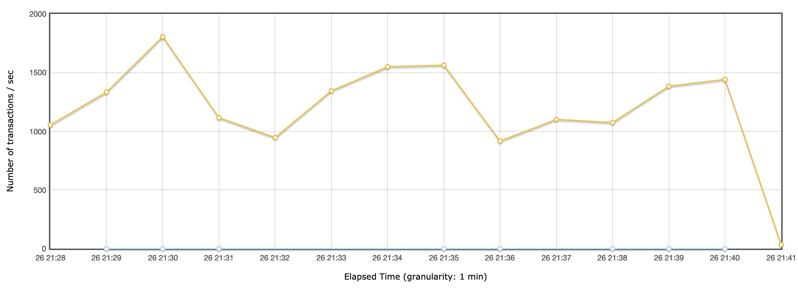 |

> - запрос добавления индекса:   
> CREATE INDEX IF NOT EXISTS idx_first_name_second_name_gin ON users USING gin (first_name gin_trgm_ops, second_name gin_trgm_ops);

> - explain запроса после индекса:  
    EXPLAIN ANALYZE SELECT * FROM users WHERE first_name ILIKE '%Ива%' AND second_name ILIKE '%Ива%';   
    -[ RECORD 1 ]------------------------------------------------------------------------------------------------------------------------------------------     
    QUERY PLAN | Bitmap Heap Scan on users  (cost=41.13..1895.71 rows=501 width=345) (actual time=0.951..6.695 rows=530 loops=1)    
    -[ RECORD 2 ]------------------------------------------------------------------------------------------------------------------------------------------     
    QUERY PLAN |   Recheck Cond: (((first_name)::text ~~* '%Ива%'::text) AND ((second_name)::text ~~* '%Ива%'::text))   
    -[ RECORD 3 ]------------------------------------------------------------------------------------------------------------------------------------------     
    QUERY PLAN |   Heap Blocks: exact=368   
    -[ RECORD 4 ]------------------------------------------------------------------------------------------------------------------------------------------     
    QUERY PLAN |   ->  Bitmap Index Scan on idx_first_name_second_name_gin  (cost=0.00..41.01 rows=501 width=0) (actual time=0.872..0.872 rows=530 loops=1) 
    -[ RECORD 5 ]------------------------------------------------------------------------------------------------------------------------------------------     
    QUERY PLAN |         Index Cond: (((first_name)::text ~~* '%Ива%'::text) AND ((second_name)::text ~~* '%Ива%'::text))   
    -[ RECORD 6 ]------------------------------------------------------------------------------------------------------------------------------------------     
    QUERY PLAN | Planning Time: 0.567 ms    
    -[ RECORD 7 ]------------------------------------------------------------------------------------------------------------------------------------------     
    QUERY PLAN | Execution Time: 6.810 ms   

> - объяснение почему индекс именно такой:  
> Так как целевое использование endpoint'a - полнотекстовый поиск по 2 полям (first_name и second_name), то был выбран GIN индекс. 
> И так как поиск по подстроке в любом положении (LIKE как с ведущим %, так и с закрывающим %), то было добавлено для БД расширение pg_trgm